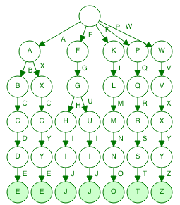

## Problem Text

--- Part Two ---

Confident that your list of box IDs is complete, you're ready to find the boxes full of prototype fabric.

The boxes will have IDs which differ by exactly one character at the same position in both strings. For example, given the following box IDs:

abcde
fghij
klmno
pqrst
fguij
axcye
wvxyz

The IDs abcde and axcye are close, but they differ by two characters (the second and fourth). However, the IDs fghij and fguij differ by exactly one character, the third (h and u). Those must be the correct boxes.

What letters are common between the two correct box IDs? (In the example above, this is found by removing the differing character from either ID, producing fgij.)

## My Comments

This problem suggests that we'd use [Hamming distance](https://en.wikipedia.org/wiki/Hamming_distance) to compare two strings. 

My first inclination was for every row in the input, check every row in the input below and calculate the hamming distance. This seemed like a brute force method and instead I'm going to use a trie to minimize the number of checks needed. Visualization (created [here](https://www.cs.usfca.edu/~galles/visualization/Trie.html))

We check every fork in the Trie and calculate the hamming distance there.

Just found out about [setdefault](https://docs.python.org/3/library/stdtypes.html), game changing.

So we actually build the trie and then walk the common children, checking only those paths for a hamming distance of 1. 

**Please note, this solution does not work if the two words in common both start with different letters** This is because the trie starts with the root node and forks for different letters and we only search common starting letters words. We could fix this, but I chose not too.